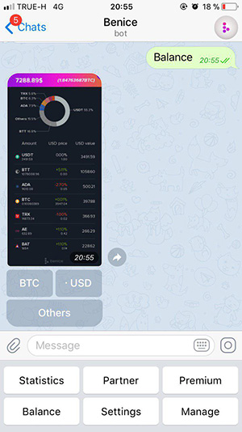
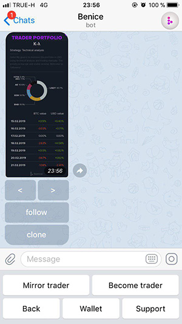

## What the hug?
Basically, its server side chrome as renderer, each user could use his own "Tab" 

Then, service layer proxies calls from telegram to web page and returns image with next available actions.
## Example
Working example can be found at telegram @Benice_tools_bot 
## Example screens
 
## Where is code
If you interested - click star, we will open more info on 100.